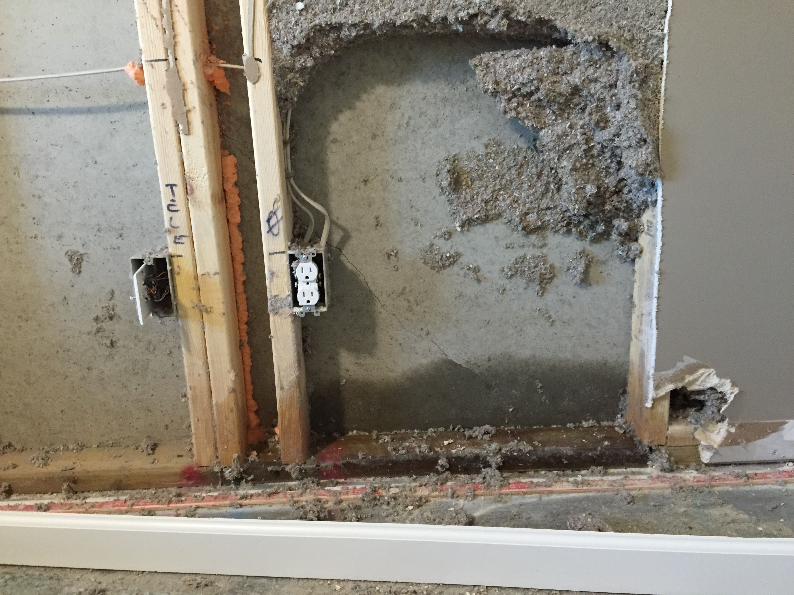
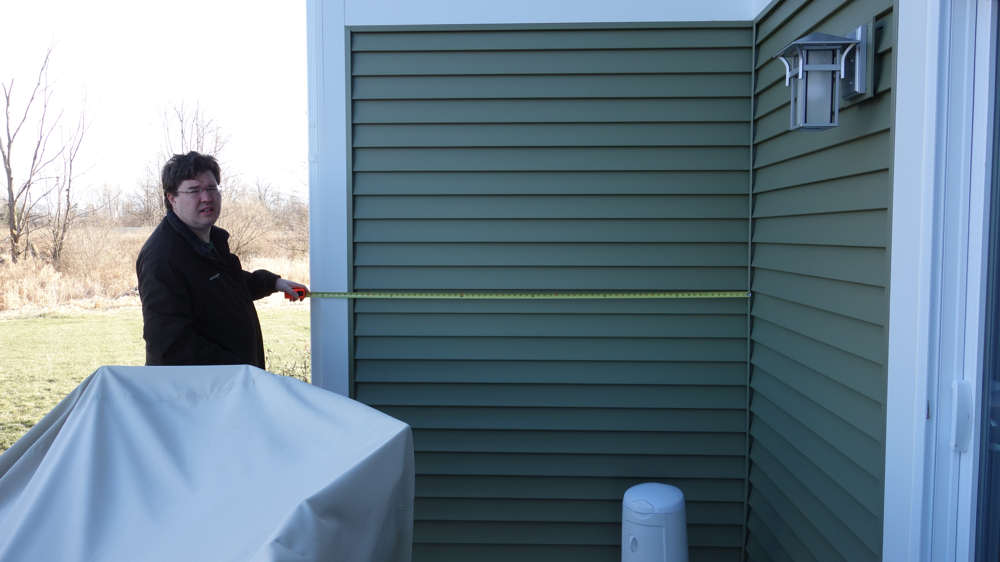
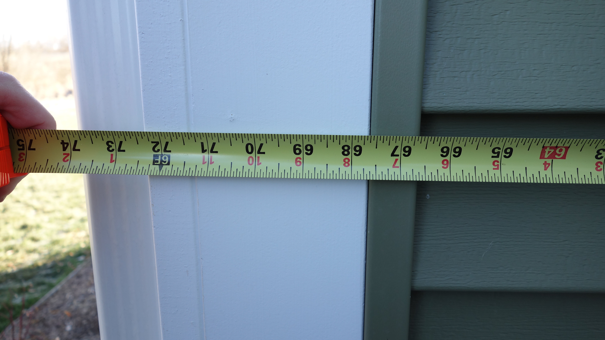
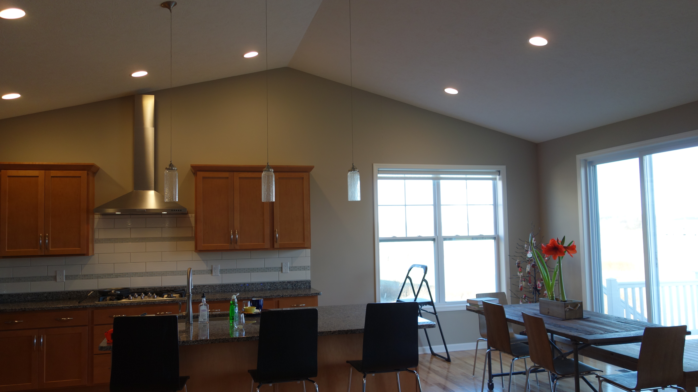
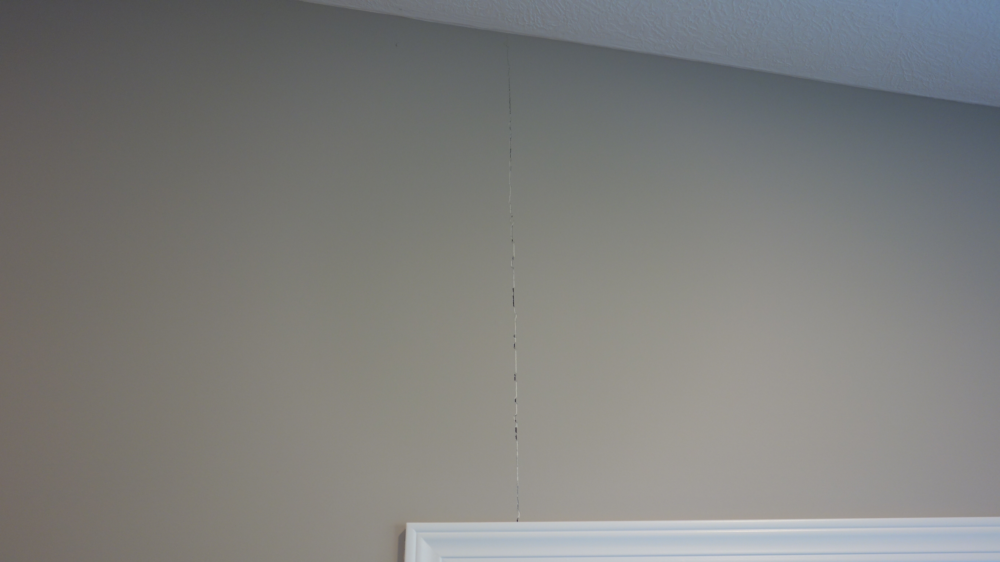
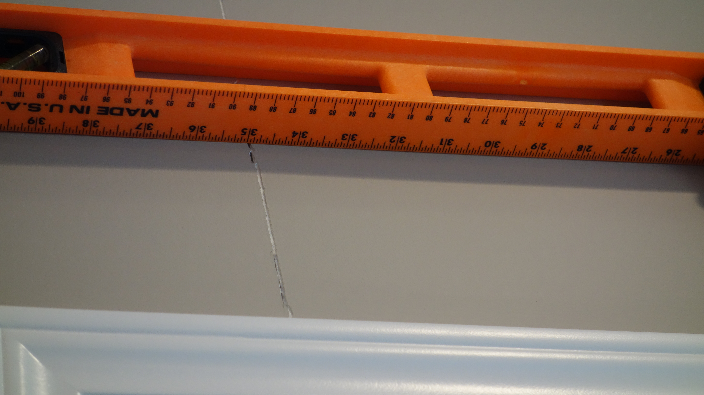
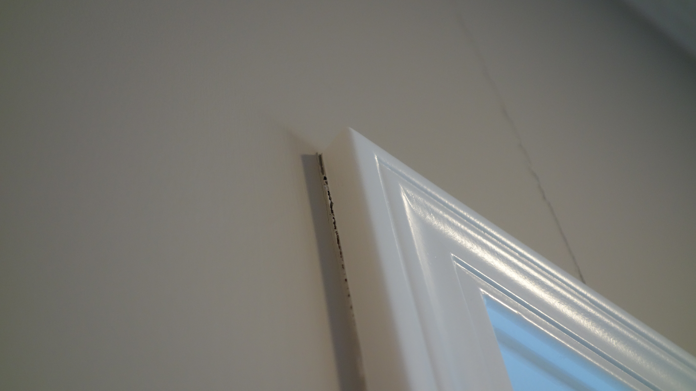
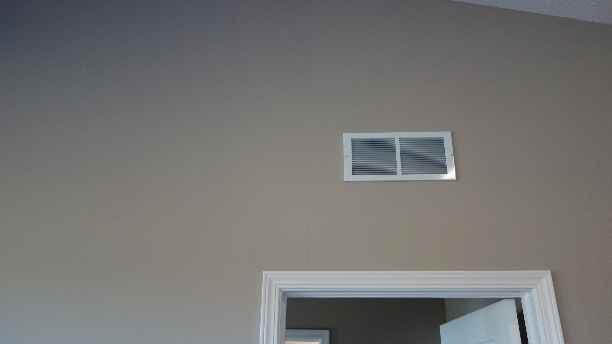

Here we have collected information about a number of cracks and settling of the basement of 2712 Kittanset Dr Okemos MI.

### Summary

We believe that back of the house is sinking.   There are matching "sister" cracks in the basement foundation: one on
the east wall of the basement foundation, and one at exactly the same place on the west wall of the basement foundation.
The crack in the east wall has already led to water seeping into the house.  This crack is narrower at the bottom and
wider at the top, and is approximately the same width on both the inside and outside of the foundation wall.  There are
cracks in the drywall on the main floor that also indicate that the back of the house is lower now than it originally
was.

### Chronology

* **November 20-24, 2014**: We were out of town, but there was a freeze followed by a thaw and rainfall.
* **November 26, 2014**: We discovered the carpet was wet in the guest bedroom in the basement along the east wall.  We
emailed Mayberry Homes to report the issue.  Since this was a holiday, we did not receive a response.
* **December 2, 2014**: Dave from Mayberry arrived to examine the issue.  He pulled up the carpet and carpet pad that
was wet, and cut away drywall and insulation to find the crack in the foundation along the east wall.  The foundation
was still wet when he was here.
* **December 10, 2014**: We discovered a similar crack on the west wall of the foundation.  Upon measuring, we found
that the two cracks are at exactly the same place in the foundation on opposite walls. This suggests that the whole back
end of the house is sinking.

### Details

Click on any image to view/download the original.

#### East Wall Crack, Inside

This was the first crack we discovered.  It was seeping water into the basement.  Here is a picture of crack from the
inside of the house.

December 2, 2014.  Inside the East Wall.

This crack is diagonal. It is narrow at the bottom:

December 11, 2014.  Inside the East Wall.

And wider as it goes up higher on the wall.  

December 11, 2014.  Inside the East Wall.

We cannot measure the top of the crack because it is behind a 2x4.

#### East Wall Crack, Outside

The crack in the east wall is all the way through the concrete, and can be seen on the outside of the house.  This crack
is approximately 12'3" from the back side of the house:

December 11, 2014.  Outside the East Wall.

#### West Wall Crack, Outside

We found a matching sister crack on the west wall of the foundation.  It is exactly 6'3" from the back of the house:

December 11, 2014.  Outside the West Wall.

The back of the west wall is 6' shorter than the back of the east wall:

December 11, 2014.  Outside the East Wall Extension.

This means that the crack in the east wall is in exactly the same place on the foundation west wall as the crack on the
east wall:  6' + 6'3" = 12'3

#### Main Floor Cracks in Drywall

The house has a walkout basement, with one floor -- the main floor -- above this.  On the main floor, we see evidence of
sinking along the west wall of the house.  The drywall above the window along the west wall in the northern corner has
separated:

December 11, 2014.  Inside the West Wall, main floor.

That crack is about 1/16" big.  Additionally, we are seeing the frame of the window pull away from the wall.

December 11, 2014.  Inside the West Wall, main floor.

Additionally, in the middle of the house, there is another drywall separation occuring.  It has not resulted in a crack
in the paint yet.

December 11, 2014.  Inside. The center wall, main floor.

